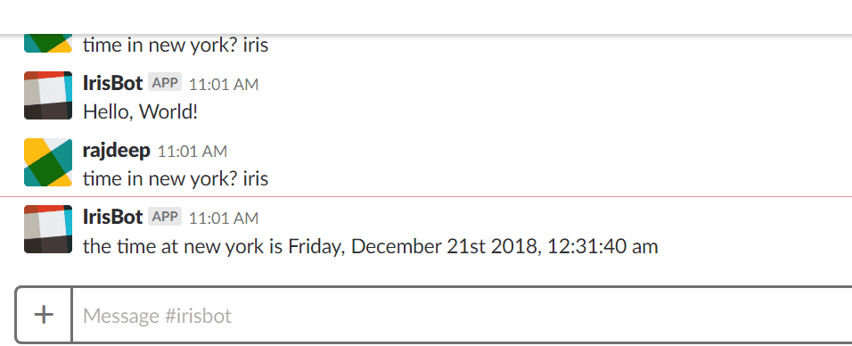

# IrisChatBot
Node js based chat bot that connects to slack and uses wit.ai NLP preocessing to respond to messages,
acts as a tutorial to microservices  architecture.

Iris uses wit.ai to parse messages on a slack channel it is registered to and responds based on the microservices that are registered 
in its registry.
two microservices are implemented : 
 - time: uses google maps timezone api
 - weather: uses openweather api
                                              
### TODO:
- add authentication to add bot to multiple channels easily
- add more services, maybe reporterservice similar to https://cdn.scotch.io/58448/QqfiCY2zRkuqn8BROVxV_demo.gif
- bot needs to train better and handle more cases

### Demo

### How to Install:
// todo